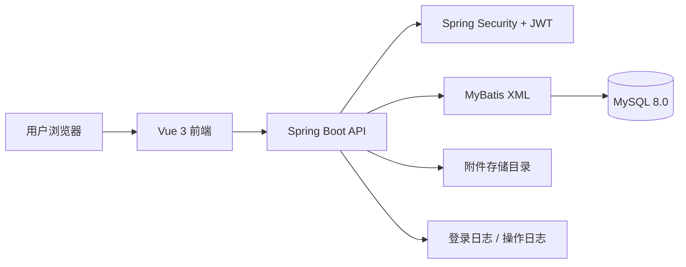
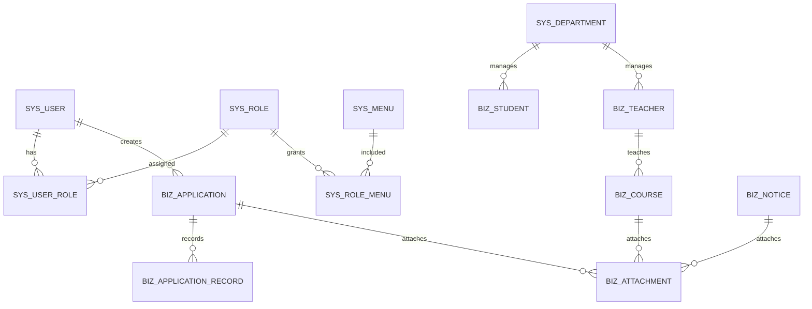

# 高校综合信息管理系统中期报告

## 基本信息

| 项目 | 内容 |
| --- | --- |
| 项目名称 | 高校综合信息管理系统 |
| 学院 | 计算机学院 |
| 小组序号 | 32 |
| 成员姓名 | 钟磊 / 仇欣皓 / 曹伟 / 罗旭 / 金凡竣 |
| 指导老师 | 尹兆远 |
| 当前版本 | 中期版 |
| 更新日期 | 2026年5月6日 |

## 一、项目概述

### 1. 项目背景

高校日常管理涉及用户账号、组织部门、学生档案、教师档案、课程信息、通知公告、业务申请、附件材料和系统日志等多类数据。传统方式通常依赖表格、即时通信记录或分散文件进行维护，容易出现数据重复录入、查询效率低、权限边界不清晰、审批过程难追踪、附件材料难统一管理等问题。

本项目面向高校综合信息管理场景，设计并开发一套基于 Web 的前后端分离信息系统。系统以统一登录、权限控制、基础数据管理、业务数据维护、申请审批、附件管理和日志审计为核心，目标是为管理员、教师和业务人员提供统一的数据管理入口。

### 2. 系统目标

系统计划实现以下目标：

- 建立统一登录入口，实现基于 JWT 的登录认证。
- 建立用户、角色、菜单和按钮权限体系，实现动态菜单和按钮级权限控制。
- 实现部门、学生、教师等基础信息的增删改查。
- 实现课程、公告、申请等业务数据的维护。
- 实现申请提交、撤回、审批通过、审批驳回和流转记录查询。
- 实现附件上传、下载、删除以及业务数据删除后的附件联动清理。
- 实现登录日志和操作日志，记录关键行为。
- 建立前端 E2E 测试、后端集成测试和部署说明，保证项目可运行、可验收、可继续扩展。

### 3. 开发环境

| 类别 | 方案 |
| --- | --- |
| 前端开发工具 | HBuilder X、VS Code |
| 后端开发工具 | IntelliJ IDEA 2024.3.2 |
| 前端技术 | Vue 3、JavaScript、Vite、Pinia、Vue Router、Element Plus、Axios |
| 后端技术 | Java 17、Spring Boot 3、Spring Security、JWT、MyBatis XML |
| 数据库 | MySQL 8.0 |
| 测试工具 | JUnit 5、Spring Boot Test、Playwright |
| 部署环境 | Ubuntu、Nginx、systemd、MySQL |
| 版本管理 | Git、GitHub |

## 二、需求分析

### 1. 功能需求

系统主要面向系统管理员、教师用户、业务管理员和审批人员。不同用户登录后，根据角色权限显示对应菜单和按钮，后端接口同步进行鉴权，避免仅依赖前端控制。

主要功能需求如下：

| 序号 | 功能模块 | 功能说明 |
| --- | --- | --- |
| 1 | 登录认证 | 用户输入账号密码登录，后端校验后签发 JWT，前端保存登录状态 |
| 2 | 个人中心 | 查看当前用户信息，支持登录密码修改 |
| 3 | 工作台 | 展示用户、学生、教师、课程、申请、待办等统计信息 |
| 4 | 用户管理 | 用户分页查询、新增、编辑、删除、状态切换、重置密码、分配角色 |
| 5 | 角色管理 | 角色新增、编辑、删除、状态维护、菜单和按钮权限分配 |
| 6 | 菜单管理 | 菜单树维护、路由配置、按钮权限码维护 |
| 7 | 部门管理 | 部门树维护、部门新增、编辑、删除和下拉选择 |
| 8 | 学生管理 | 学生信息维护、导入、导出、批量删除、创建账号 |
| 9 | 教师管理 | 教师信息维护、导入、导出、批量删除、创建账号 |
| 10 | 课程管理 | 课程新增、编辑、删除、分页查询、附件关联 |
| 11 | 公告管理 | 公告草稿、发布、撤回、编辑、删除和附件关联 |
| 12 | 申请管理 | 申请新增、编辑、提交、撤回、审批和流转记录查询 |
| 13 | 工作流 | 查询待办、已办任务，对申请执行通过或驳回 |
| 14 | 附件管理 | 附件上传、下载、删除，按业务对象查询附件列表 |
| 15 | 日志管理 | 查询登录日志和操作日志，用于问题追踪和审计 |

典型业务流程如下：

1. 用户访问登录页，输入账号和密码。
2. 后端校验账号状态和密码，返回 JWT、用户信息、角色和权限。
3. 前端根据菜单数据渲染左侧导航，根据权限码控制按钮显隐。
4. 管理员维护用户、角色、菜单、部门等基础配置。
5. 业务用户维护学生、教师、课程、公告和申请数据。
6. 申请提交后进入待办列表，审批人员执行通过或驳回。
7. 系统记录关键操作日志，附件随业务数据进行绑定和清理。

### 2. 非功能需求

| 类别 | 要求 |
| --- | --- |
| 性能要求 | 列表接口采用分页查询，常规查询在普通开发环境中应在 2 秒内返回 |
| 安全要求 | 登录后使用 JWT 访问接口；后端基于权限码鉴权；密码使用 BCrypt 加密存储 |
| 数据要求 | 数据库字符集使用 utf8mb4；核心业务支持逻辑删除或审计记录 |
| 兼容性要求 | 前端支持现代 Chromium 内核浏览器；后端基于 JDK 17 运行 |
| 可维护性要求 | 前后端按模块划分目录，接口采用 RESTful 风格，文档与代码同步维护 |
| 可测试性要求 | 后端提供集成测试，前端提供 Playwright 冒烟测试，测试库与开发库隔离 |

## 三、系统设计

### 1. 系统架构

系统采用前后端分离架构，前端通过 Vite 开发服务器或 Nginx 静态资源服务向用户提供页面，后端提供 RESTful API，数据库使用 MySQL 保存业务数据，附件文件存储在后端本地目录。



前端职责：

- 页面布局、表单交互、列表展示和附件交互。
- 登录状态维护、动态路由生成、菜单渲染。
- 请求封装、异常提示、按钮权限控制。

后端职责：

- 登录认证、JWT 生成和解析、接口鉴权。
- 业务参数校验、核心业务逻辑、数据持久化。
- 附件上传下载、日志记录、统一异常处理。

数据库职责：

- 保存系统管理、人员管理、业务管理、工作流、附件和日志数据。
- 通过外键含义和业务字段维护模块之间的关联关系。

### 2. 模块设计

| 模块 | 主要职责 |
| --- | --- |
| auth | 登录、退出、当前用户信息、动态菜单、权限码、修改密码 |
| system/user | 用户账号维护、状态切换、重置密码、角色分配 |
| system/role | 角色维护、角色权限分配 |
| system/menu | 菜单树、路由配置、按钮权限配置 |
| organization/department | 部门树、部门下拉、组织基础数据维护 |
| personnel/student | 学生档案、导入导出、批量删除、账号绑定 |
| personnel/teacher | 教师档案、导入导出、批量删除、账号绑定 |
| business/course | 课程维护、授课教师关联、附件数量统计 |
| business/notice | 公告维护、发布撤回、附件关联 |
| business/application | 申请维护、提交撤回、审批状态维护 |
| workflow | 待办、已办、审批通过和驳回 |
| file/attachment | 附件上传、下载、删除和业务绑定 |
| dashboard | 工作台实时统计、待办和趋势数据 |
| system/log | 登录日志和操作日志查询 |

### 3. 数据库设计

系统数据库主要分为六类表：

| 类型 | 数据表 |
| --- | --- |
| 组织权限 | sys_user、sys_role、sys_menu、sys_department、sys_user_role、sys_role_menu |
| 人员档案 | biz_student、biz_teacher |
| 业务数据 | biz_course、biz_notice、biz_application |
| 工作流 | biz_application_record |
| 附件 | biz_attachment |
| 日志 | sys_login_log、sys_operation_log |

核心关系如下：



主要表设计摘要如下：

| 表名 | 说明 | 关键字段 |
| --- | --- | --- |
| sys_user | 用户账号表 | username、password、real_name、user_type、ref_id、status、deleted |
| sys_role | 角色表 | name、code、description、status、deleted |
| sys_menu | 菜单与按钮权限表 | parent_id、type、path、component、permission、visible、status |
| sys_department | 部门表 | parent_id、name、code、sort_order、status |
| biz_student | 学生表 | student_no、name、gender、department_id、major、grade、class_name、account_id |
| biz_teacher | 教师表 | teacher_no、name、gender、department_id、title、account_id |
| biz_course | 课程表 | course_code、course_name、teacher_id、credit、hours、attachment_count |
| biz_notice | 公告表 | title、content、status、publisher_id、publish_time、attachment_count |
| biz_application | 申请表 | title、type、applicant_id、status、reviewer_id、attachment_count |
| biz_attachment | 附件表 | business_type、business_id、original_name、storage_path、file_size |
| sys_login_log | 登录日志表 | username、ip、browser、os、success、message |
| sys_operation_log | 操作日志表 | module、operation、method、url、operator_id、success、cost_time |

## 四、系统实现

### 1. 关键技术

项目现阶段已经确定并开始实现以下关键技术：

| 技术 | 应用位置 | 说明 |
| --- | --- | --- |
| JWT | 登录认证 | 登录成功后返回令牌，后续请求通过 Authorization 请求头访问 |
| Spring Security | 后端安全 | 统一处理认证、鉴权、未登录和无权限响应 |
| MyBatis XML | 数据访问 | SQL 独立维护，便于分页查询、条件查询和关联查询 |
| Pinia | 前端状态 | 保存 token、用户信息、菜单和权限码 |
| Vue Router | 前端路由 | 根据后端菜单数据生成动态路由 |
| Element Plus | 前端组件 | 快速实现表单、表格、弹窗、上传、分页等交互 |
| Playwright | 前端测试 | 覆盖登录、导航和权限收敛等关键链路 |

后端分层结构如下：

```text
controller -> service -> mapper -> mapper.xml -> MySQL
```

前端模块结构如下：

```text
api -> store/router -> views/components -> utils/request
```

### 2. 界面展示

中期阶段已完成或形成原型的页面包括：

| 页面 | 当前状态 | 说明 |
| --- | --- | --- |
| 登录页 | 已设计 | 支持账号密码登录和登录失败提示 |
| 主布局 | 已设计 | 包含顶部栏、侧边菜单、内容区和退出入口 |
| 工作台 | 原型完成 | 展示统计卡片、待办列表和趋势数据 |
| 用户管理 | 开发中 | 支持列表、查询、新增、编辑、状态和角色操作 |
| 角色管理 | 开发中 | 支持角色维护和权限分配 |
| 菜单管理 | 开发中 | 支持菜单树和按钮权限配置 |
| 学生管理 | 开发中 | 支持学生查询、新增、编辑、导入导出和账号创建 |
| 教师管理 | 计划中 | 复用学生管理交互模式 |
| 课程/公告/申请 | 计划中 | 业务 CRUD 与附件交互统一设计 |
| 日志管理 | 计划中 | 查询登录日志和操作日志 |

界面截图后续统一存放到 `docs/report/assets/`，建议命名为 `fig_ui_login.png`、`fig_ui_dashboard.png`、`fig_ui_student.png`。

### 3. 核心代码片段

中期阶段核心代码主要集中在登录认证和学生模块后端骨架。典型接口结构如下：

```java
@RestController
@RequestMapping("/api/students")
public class StudentController {
    private final StudentService studentService;

    @GetMapping
    public ApiResponse<PageResponse<StudentPageItemVO>> page(StudentQueryRequest request) {
        return ApiResponse.success(studentService.page(request));
    }
}
```

该结构体现了项目统一的后端接口风格：Controller 接收请求，Service 处理业务逻辑，Mapper 负责数据库访问，最终通过 `ApiResponse` 返回统一 JSON 结构。

## 五、系统测试

### 1. 测试方案

项目计划从后端接口、前端页面、权限链路和完整业务闭环四个方面进行测试。

| 测试类型 | 测试范围 | 测试方法 |
| --- | --- | --- |
| 后端集成测试 | 登录、用户、权限、学生等核心接口 | 使用 JUnit 5 和 Spring Boot Test，连接测试数据库 |
| 前端 E2E 测试 | 登录、导航、教师权限收敛 | 使用 Playwright 模拟浏览器操作 |
| 接口联调测试 | 前端请求字段、后端响应字段、异常提示 | 使用浏览器和开发环境联调 |
| 业务闭环测试 | 新建业务数据、绑定附件、提交审批、删除清理 | 通过管理员和教师账号执行完整流程 |
| 权限测试 | 菜单权限、按钮权限、接口权限 | 使用不同角色账号对比页面和接口访问结果 |

### 2. 中期测试用例

| 编号 | 测试项 | 预期结果 | 当前状态 |
| --- | --- | --- | --- |
| T-01 | 管理员登录 | 登录成功，进入工作台 | 已纳入测试计划 |
| T-02 | 错误密码登录 | 返回错误提示，不进入系统 | 已纳入测试计划 |
| T-03 | 动态菜单加载 | 菜单按当前角色权限显示 | 已纳入测试计划 |
| T-04 | 学生分页查询 | 返回分页数据和总数 | 开发中 |
| T-05 | 学生新增编辑删除 | 数据正确写入并可查询 | 开发中 |
| T-06 | 教师账号权限 | 菜单和按钮按教师角色收敛 | 已纳入测试计划 |
| T-07 | 附件上传下载 | 文件元数据和物理文件一致 | 后续补充 |
| T-08 | 申请审批 | 申请状态和流转记录同步变化 | 后续补充 |
| T-09 | 操作日志 | 关键操作生成日志记录 | 后续补充 |
| T-10 | 前端构建 | `npm run build` 成功 | 后续补充 |

### 3. 问题与改进

| 问题 | 影响 | 改进措施 |
| --- | --- | --- |
| 模块较多，开发范围容易扩大 | 影响按期完成 | 按登录、权限、学生、教师、业务模块分阶段提交 |
| 前后端接口字段容易不一致 | 增加联调成本 | 先维护接口文档，再按接口实现 |
| 权限控制同时涉及前后端 | 容易出现页面可见但接口无权限 | 后端鉴权为准，前端只做体验层控制 |
| 测试数据库依赖本地 MySQL | 测试环境易受本地服务影响 | 使用独立测试库和环境变量配置 |
| 结项文档需要截图和 Git 记录 | 后期整理成本较高 | 开发过程中持续补充截图、测试记录和提交说明 |

## 六、用户手册

中期阶段先记录初步运行方式，结项阶段根据最终系统补充完整截图和操作步骤。

### 1. 安装部署说明

本地开发运行步骤如下：

```bash
cd backend
DB_USERNAME=root DB_PASSWORD=123456 mvn spring-boot:run
```

```bash
cd frontend
npm install
npm run dev
```

默认访问地址：

```text
前端：http://localhost:5173
后端：http://localhost:8080
```

### 2. 操作指南

1. 管理员登录后进入工作台。
2. 在系统管理中维护用户、角色、菜单和权限。
3. 在组织管理中维护部门数据。
4. 在人员管理中维护学生和教师档案。
5. 在业务管理中维护课程、公告和申请。
6. 在工作流中处理待办任务。
7. 在附件管理中查看和下载业务附件。
8. 在日志管理中查看登录日志和操作日志。

## 七、项目总结

### 1. 阶段成果

截至中期阶段，项目已完成选题、需求分析、技术路线确认、项目计划书、数据库初步设计、接口清单、前后端项目结构设计和部分核心模块开发。登录认证、JWT 权限方案、动态菜单、学生后端模块和基础文档已进入实现或提交阶段，后续将继续按模块完成前后端联调。

### 2. 当前不足

- 部分业务模块仍处于骨架或联调阶段，需要继续补全页面交互和接口实现。
- 课程、公告、申请与附件、日志的完整闭环仍需进一步测试。
- 结项报告所需的真实界面截图、测试截图和 Git 记录截图尚需统一整理。
- 部署服务器暂未正式上线，当前以本地开发环境运行为主。

### 3. 下一步计划

| 阶段 | 计划任务 |
| --- | --- |
| 第一步 | 完成用户、角色、菜单、部门模块的接口和页面闭环 |
| 第二步 | 完成学生、教师模块的前后端联调、导入导出和账号绑定 |
| 第三步 | 完成课程、公告、申请、工作流和附件模块 |
| 第四步 | 完成日志管理、工作台统计和权限测试 |
| 第五步 | 补充自动化测试、部署说明、软件说明书和答辩材料 |

### 4. 成员分工表

| 成员 | 班级 | 学号 | Git 账号 | 角色 | 主要任务 |
| --- | --- | --- | --- | --- | --- |
| 罗旭 | 计算机科学与技术一班 | 202405567009 | jcctkl | 前端开发1 | 登录页、主布局、动态菜单、工作台、个人中心 |
| 曹伟 | 计算机科学与技术一班 | 202405567017 | cw749 | 前端开发2 | 用户、角色、菜单、部门、学生、教师、业务页面和附件交互 |
| 仇欣皓 | 计算机科学与技术一班 | 202405567018 | Agoni18 | 后端开发1 | 登录认证、JWT、权限、用户、角色、菜单、部门、日志 |
| 钟磊 | 计算机科学与技术一班 | 202405567015 | l1160 | 后端开发2、架构设计 | 学生、教师、课程、公告、申请、工作流、附件、数据库脚本 |
| 金凡竣 | 计算机科学与技术一班 | 202405567004 | SitDForget | 测试与文档 | 后端集成测试、前端 E2E、部署文档、说明书、Git 过程材料 |

### 5. Git 提交记录说明

项目采用 GitHub 进行协作，计划按功能模块拆分 Pull Request，避免一次性提交过多无关代码。中期阶段已经形成项目计划、接口文档、登录认证和学生后端模块等过程性记录。后续将继续按照系统管理、人员管理、业务管理、附件日志、测试部署等模块推进提交。

## 附录

### 1. 参考资料

- Spring Boot 官方文档
- Spring Security 官方文档
- MyBatis 官方文档
- Vue 3 官方文档
- Element Plus 官方文档
- Playwright 官方文档

### 2. 源代码仓库

```text
https://github.com/l1160/xtu_system
```

