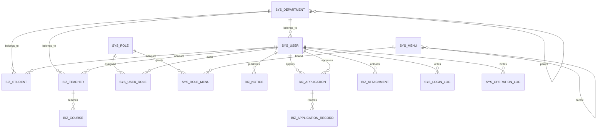

# 数据库设计说明

本系统数据库使用 MySQL 8.0，默认字符集为 `utf8mb4`，排序规则为 `utf8mb4_unicode_ci`。数据库结构通过后端迁移脚本维护，脚本目录为 `backend/src/main/resources/db/migration/`。

## 一、ER 图



## 二、建表 SQL

完整建表和初始化 SQL 采用迁移脚本方式保存，按以下顺序执行即可完成数据库初始化。

| 顺序 | SQL 文件 | 主要内容 |
| --- | --- | --- |
| 1 | `backend/src/main/resources/db/migration/V1__init_user_module.sql` | 部门、角色、用户、菜单、用户角色、角色菜单、学生、教师基础表及基础账号权限数据 |
| 2 | `backend/src/main/resources/db/migration/V2__business_modules.sql` | 课程、公告、申请表及业务菜单、按钮权限、演示业务数据 |
| 3 | `backend/src/main/resources/db/migration/V3__workflow_attachment_log.sql` | 审批记录、附件、登录日志、操作日志表及流程、附件、日志菜单数据 |

手动执行示例：

```bash
mysql -u root -p xtu_system < backend/src/main/resources/db/migration/V1__init_user_module.sql
mysql -u root -p xtu_system < backend/src/main/resources/db/migration/V2__business_modules.sql
mysql -u root -p xtu_system < backend/src/main/resources/db/migration/V3__workflow_attachment_log.sql
```

后端启用 Flyway 时，可由 Spring Boot 自动执行上述迁移脚本。

## 三、字段说明

### 1. sys_department 部门表

| 字段 | 类型 | 说明 |
| --- | --- | --- |
| id | BIGINT | 主键 ID |
| parent_id | BIGINT | 父级部门 ID，0 表示根节点 |
| dept_code | VARCHAR(64) | 部门编码 |
| dept_name | VARCHAR(100) | 部门名称 |
| dept_type | VARCHAR(32) | 部门类型 |
| leader_name | VARCHAR(50) | 负责人姓名 |
| leader_phone | VARCHAR(20) | 负责人电话 |
| sort_no | INT | 排序号 |
| status | TINYINT | 状态：1 启用，0 停用 |
| remark | VARCHAR(255) | 备注 |
| created_by | BIGINT | 创建人 ID |
| created_at | DATETIME | 创建时间 |
| updated_by | BIGINT | 修改人 ID |
| updated_at | DATETIME | 修改时间 |
| deleted | TINYINT | 逻辑删除：0 正常，1 删除 |
| version | INT | 乐观锁版本号 |

### 2. sys_role 角色表

| 字段 | 类型 | 说明 |
| --- | --- | --- |
| id | BIGINT | 主键 ID |
| role_code | VARCHAR(64) | 角色编码 |
| role_name | VARCHAR(100) | 角色名称 |
| data_scope | TINYINT | 数据范围 |
| status | TINYINT | 状态：1 启用，0 停用 |
| remark | VARCHAR(255) | 备注 |
| created_by | BIGINT | 创建人 ID |
| created_at | DATETIME | 创建时间 |
| updated_by | BIGINT | 修改人 ID |
| updated_at | DATETIME | 修改时间 |
| deleted | TINYINT | 逻辑删除：0 正常，1 删除 |
| version | INT | 乐观锁版本号 |

### 3. sys_user 用户表

| 字段 | 类型 | 说明 |
| --- | --- | --- |
| id | BIGINT | 主键 ID |
| username | VARCHAR(50) | 登录账号 |
| password_hash | VARCHAR(255) | 密码摘要 |
| real_name | VARCHAR(50) | 真实姓名 |
| user_type | TINYINT | 用户类型：1 管理员，2 教师，3 学生，4 员工 |
| dept_id | BIGINT | 所属部门 ID |
| phone | VARCHAR(20) | 手机号 |
| email | VARCHAR(100) | 邮箱 |
| avatar_url | VARCHAR(255) | 头像地址 |
| gender | TINYINT | 性别：1 男，2 女，0 未知 |
| status | TINYINT | 状态：1 启用，0 停用 |
| last_login_at | DATETIME | 最后登录时间 |
| remark | VARCHAR(255) | 备注 |
| created_by | BIGINT | 创建人 ID |
| created_at | DATETIME | 创建时间 |
| updated_by | BIGINT | 修改人 ID |
| updated_at | DATETIME | 修改时间 |
| deleted | TINYINT | 逻辑删除：0 正常，1 删除 |
| version | INT | 乐观锁版本号 |

### 4. sys_user_role 用户角色关联表

| 字段 | 类型 | 说明 |
| --- | --- | --- |
| id | BIGINT | 主键 ID |
| user_id | BIGINT | 用户 ID |
| role_id | BIGINT | 角色 ID |
| created_by | BIGINT | 创建人 ID |
| created_at | DATETIME | 创建时间 |

### 5. sys_menu 菜单权限表

| 字段 | 类型 | 说明 |
| --- | --- | --- |
| id | BIGINT | 主键 ID |
| parent_id | BIGINT | 父级菜单 ID |
| menu_name | VARCHAR(100) | 菜单名称 |
| menu_type | CHAR(1) | 菜单类型：M 目录，C 菜单，B 按钮 |
| route_path | VARCHAR(200) | 前端路由路径 |
| component_path | VARCHAR(200) | 前端组件路径 |
| permission_code | VARCHAR(100) | 权限标识 |
| icon | VARCHAR(100) | 菜单图标 |
| sort_no | INT | 排序号 |
| visible | TINYINT | 是否可见：1 是，0 否 |
| status | TINYINT | 状态：1 启用，0 停用 |
| remark | VARCHAR(255) | 备注 |
| created_by | BIGINT | 创建人 ID |
| created_at | DATETIME | 创建时间 |
| updated_by | BIGINT | 修改人 ID |
| updated_at | DATETIME | 修改时间 |
| deleted | TINYINT | 逻辑删除：0 正常，1 删除 |
| version | INT | 乐观锁版本号 |

### 6. sys_role_menu 角色菜单关联表

| 字段 | 类型 | 说明 |
| --- | --- | --- |
| id | BIGINT | 主键 ID |
| role_id | BIGINT | 角色 ID |
| menu_id | BIGINT | 菜单 ID |
| created_by | BIGINT | 创建人 ID |
| created_at | DATETIME | 创建时间 |

### 7. biz_student 学生表

| 字段 | 类型 | 说明 |
| --- | --- | --- |
| id | BIGINT | 主键 ID |
| user_id | BIGINT | 关联用户 ID |
| student_no | VARCHAR(32) | 学号 |
| student_name | VARCHAR(50) | 学生姓名 |
| gender | TINYINT | 性别：1 男，2 女，0 未知 |
| dept_id | BIGINT | 所属院系或班级 ID |
| major_name | VARCHAR(100) | 专业名称 |
| grade_year | INT | 入学年级 |
| class_name | VARCHAR(100) | 班级名称 |
| phone | VARCHAR(20) | 手机号 |
| email | VARCHAR(100) | 邮箱 |
| status | TINYINT | 状态：1 在读，0 离校 |
| remark | VARCHAR(255) | 备注 |
| created_by | BIGINT | 创建人 ID |
| created_at | DATETIME | 创建时间 |
| updated_by | BIGINT | 修改人 ID |
| updated_at | DATETIME | 修改时间 |
| deleted | TINYINT | 逻辑删除：0 正常，1 删除 |
| version | INT | 乐观锁版本号 |

### 8. biz_teacher 教师表

| 字段 | 类型 | 说明 |
| --- | --- | --- |
| id | BIGINT | 主键 ID |
| user_id | BIGINT | 关联用户 ID |
| teacher_no | VARCHAR(32) | 工号 |
| teacher_name | VARCHAR(50) | 教师姓名 |
| gender | TINYINT | 性别：1 男，2 女，0 未知 |
| dept_id | BIGINT | 所属部门 ID |
| title_name | VARCHAR(100) | 职称 |
| phone | VARCHAR(20) | 手机号 |
| email | VARCHAR(100) | 邮箱 |
| status | TINYINT | 状态：1 在职，0 离职 |
| remark | VARCHAR(255) | 备注 |
| created_by | BIGINT | 创建人 ID |
| created_at | DATETIME | 创建时间 |
| updated_by | BIGINT | 修改人 ID |
| updated_at | DATETIME | 修改时间 |
| deleted | TINYINT | 逻辑删除：0 正常，1 删除 |
| version | INT | 乐观锁版本号 |

### 9. biz_course 课程表

| 字段 | 类型 | 说明 |
| --- | --- | --- |
| id | BIGINT | 主键 ID |
| course_code | VARCHAR(32) | 课程编码 |
| course_name | VARCHAR(100) | 课程名称 |
| dept_id | BIGINT | 所属部门 ID |
| teacher_id | BIGINT | 授课教师 ID |
| credit | DECIMAL(4, 1) | 学分 |
| course_type | VARCHAR(32) | 课程类型 |
| semester | VARCHAR(32) | 开课学期 |
| status | TINYINT | 状态：1 启用，0 停用 |
| remark | VARCHAR(255) | 备注 |
| created_by | BIGINT | 创建人 ID |
| created_at | DATETIME | 创建时间 |
| updated_by | BIGINT | 修改人 ID |
| updated_at | DATETIME | 修改时间 |
| deleted | TINYINT | 逻辑删除：0 正常，1 删除 |
| version | INT | 乐观锁版本号 |

### 10. biz_notice 公告表

| 字段 | 类型 | 说明 |
| --- | --- | --- |
| id | BIGINT | 主键 ID |
| title | VARCHAR(150) | 公告标题 |
| notice_type | VARCHAR(32) | 公告类型 |
| content | TEXT | 公告内容 |
| publish_status | TINYINT | 发布状态：0 草稿，1 已发布 |
| pinned | TINYINT | 是否置顶：0 否，1 是 |
| publisher_id | BIGINT | 发布人 ID |
| publish_time | DATETIME | 发布时间 |
| created_by | BIGINT | 创建人 ID |
| created_at | DATETIME | 创建时间 |
| updated_by | BIGINT | 修改人 ID |
| updated_at | DATETIME | 修改时间 |
| deleted | TINYINT | 逻辑删除：0 正常，1 删除 |
| version | INT | 乐观锁版本号 |

### 11. biz_application 申请单表

| 字段 | 类型 | 说明 |
| --- | --- | --- |
| id | BIGINT | 主键 ID |
| applicant_user_id | BIGINT | 申请人用户 ID |
| applicant_name | VARCHAR(50) | 申请人姓名 |
| application_type | VARCHAR(32) | 申请类型 |
| target_name | VARCHAR(100) | 申请对象 |
| reason | VARCHAR(500) | 申请原因 |
| status | TINYINT | 状态：0 待审核，1 已通过，2 已驳回 |
| submit_time | DATETIME | 提交时间 |
| process_time | DATETIME | 处理时间 |
| approver_user_id | BIGINT | 审核人用户 ID |
| approver_name | VARCHAR(50) | 审核人姓名 |
| review_remark | VARCHAR(255) | 审核备注 |
| created_by | BIGINT | 创建人 ID |
| created_at | DATETIME | 创建时间 |
| updated_by | BIGINT | 修改人 ID |
| updated_at | DATETIME | 修改时间 |
| deleted | TINYINT | 逻辑删除：0 正常，1 删除 |
| version | INT | 乐观锁版本号 |

### 12. biz_application_record 审批记录表

| 字段 | 类型 | 说明 |
| --- | --- | --- |
| id | BIGINT | 主键 ID |
| application_id | BIGINT | 申请单 ID |
| step_no | INT | 步骤序号 |
| approver_id | BIGINT | 处理人 ID |
| approver_name | VARCHAR(50) | 处理人姓名 |
| action_type | VARCHAR(20) | 动作类型：submit、approve、reject、withdraw |
| comment_text | VARCHAR(500) | 处理意见 |
| before_status | TINYINT | 处理前状态 |
| after_status | TINYINT | 处理后状态 |
| acted_at | DATETIME | 处理时间 |
| created_at | DATETIME | 创建时间 |

### 13. biz_attachment 附件表

| 字段 | 类型 | 说明 |
| --- | --- | --- |
| id | BIGINT | 主键 ID |
| biz_type | VARCHAR(50) | 关联业务类型 |
| biz_id | BIGINT | 关联业务 ID |
| file_name | VARCHAR(255) | 原始文件名 |
| file_ext | VARCHAR(20) | 文件扩展名 |
| content_type | VARCHAR(100) | 文件 MIME 类型 |
| file_size | BIGINT | 文件大小 |
| storage_type | VARCHAR(20) | 存储类型 |
| bucket_name | VARCHAR(100) | 存储桶名称 |
| object_key | VARCHAR(255) | 存储对象 Key |
| file_url | VARCHAR(500) | 文件访问地址 |
| uploader_id | BIGINT | 上传人 ID |
| created_by | BIGINT | 创建人 ID |
| created_at | DATETIME | 创建时间 |
| updated_by | BIGINT | 修改人 ID |
| updated_at | DATETIME | 修改时间 |
| deleted | TINYINT | 逻辑删除：0 正常，1 删除 |
| version | INT | 乐观锁版本号 |

### 14. sys_login_log 登录日志表

| 字段 | 类型 | 说明 |
| --- | --- | --- |
| id | BIGINT | 主键 ID |
| user_id | BIGINT | 用户 ID |
| username | VARCHAR(50) | 登录账号 |
| real_name | VARCHAR(50) | 真实姓名 |
| login_type | VARCHAR(20) | 登录方式 |
| login_ip | VARCHAR(64) | 登录 IP |
| login_location | VARCHAR(100) | 登录地点 |
| user_agent | VARCHAR(500) | User-Agent |
| browser | VARCHAR(100) | 浏览器 |
| os | VARCHAR(100) | 操作系统 |
| login_status | TINYINT | 登录结果 |
| fail_reason | VARCHAR(255) | 失败原因 |
| login_at | DATETIME | 登录时间 |

### 15. sys_operation_log 操作日志表

| 字段 | 类型 | 说明 |
| --- | --- | --- |
| id | BIGINT | 主键 ID |
| module_name | VARCHAR(50) | 模块名称 |
| biz_type | VARCHAR(50) | 业务类型 |
| biz_id | BIGINT | 业务 ID |
| operation_type | VARCHAR(20) | 操作类型 |
| request_uri | VARCHAR(255) | 请求地址 |
| request_method | VARCHAR(10) | 请求方法 |
| request_params | TEXT | 请求参数 |
| operator_id | BIGINT | 操作人 ID |
| operator_name | VARCHAR(50) | 操作人姓名 |
| operator_ip | VARCHAR(64) | 操作 IP |
| result_status | TINYINT | 执行结果 |
| error_message | VARCHAR(500) | 错误信息 |
| created_at | DATETIME | 操作时间 |

## 四、初始化数据

### 1. 基础组织与账号

| 表 | 初始化内容 |
| --- | --- |
| sys_department | 系统管理部、信息工程学院 |
| sys_role | 系统管理员、教师、学生 |
| sys_user | 管理员账号 `admin`、教师账号 `teacher01` |
| sys_user_role | 管理员绑定系统管理员角色，教师账号绑定教师角色 |
| biz_student | 初始化学生档案：李同学、王同学 |
| biz_teacher | 初始化教师档案：张老师、李老师 |

### 2. 菜单与权限

| 模块 | 初始化菜单和权限 |
| --- | --- |
| 工作台 | 工作台查看权限 |
| 系统管理 | 用户管理、角色管理、菜单管理、日志管理及对应按钮权限 |
| 组织管理 | 部门管理及新增、编辑、删除权限 |
| 人员管理 | 学生管理、教师管理及新增、编辑、删除、账号管理权限 |
| 业务管理 | 课程管理、公告管理、申请管理、附件管理及对应按钮权限 |
| 流程中心 | 审批任务菜单 |

### 3. 业务演示数据

| 表 | 初始化内容 |
| --- | --- |
| biz_course | 软件工程导论、数据库系统原理 |
| biz_notice | 2026 春季学期选课提醒、教师资料维护说明 |
| biz_application | 课程调整申请、公告发布申请 |
| biz_application_record | 申请提交记录和审批通过记录 |

### 4. 日志与附件

日志表和附件表只初始化表结构，不预置附件文件。系统运行后会根据登录、接口操作和文件上传自动写入 `sys_login_log`、`sys_operation_log` 和 `biz_attachment`。

## 五、设计说明

- 权限模型采用 RBAC：`sys_user` 通过 `sys_user_role` 关联 `sys_role`，`sys_role` 通过 `sys_role_menu` 关联 `sys_menu`。
- 菜单表同时保存目录、页面菜单和按钮权限，前端可基于后端返回的菜单树动态渲染左侧菜单，并基于 `permission_code` 控制按钮显示。
- 学生、教师分别通过 `user_id` 与用户账号打通，便于实现统一登录和人员档案管理。
- 课程、公告、申请是核心业务表，附件表通过 `biz_type + biz_id` 关联不同业务记录。
- 日志表分为登录日志和操作日志，便于审计用户访问和关键业务操作。
